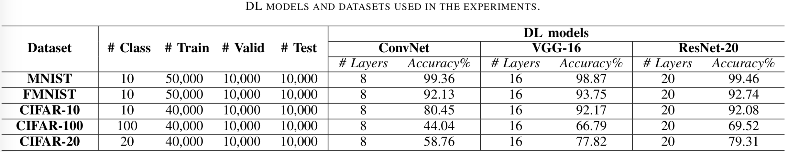
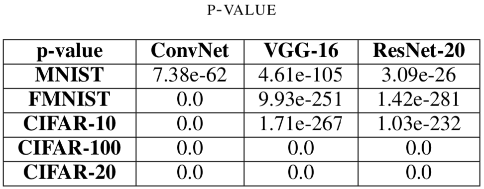
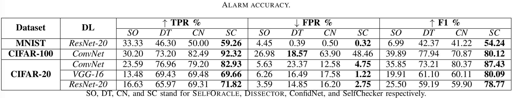
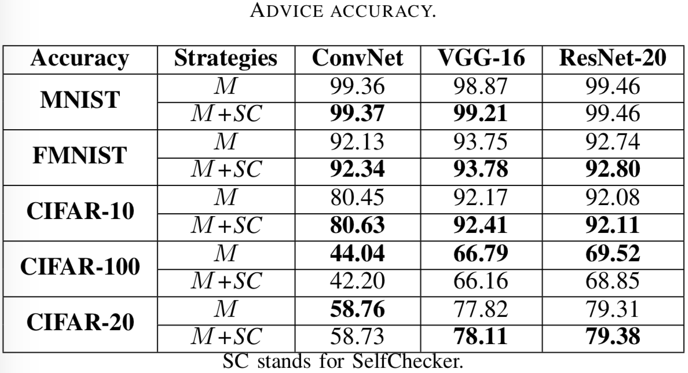
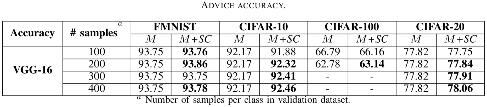
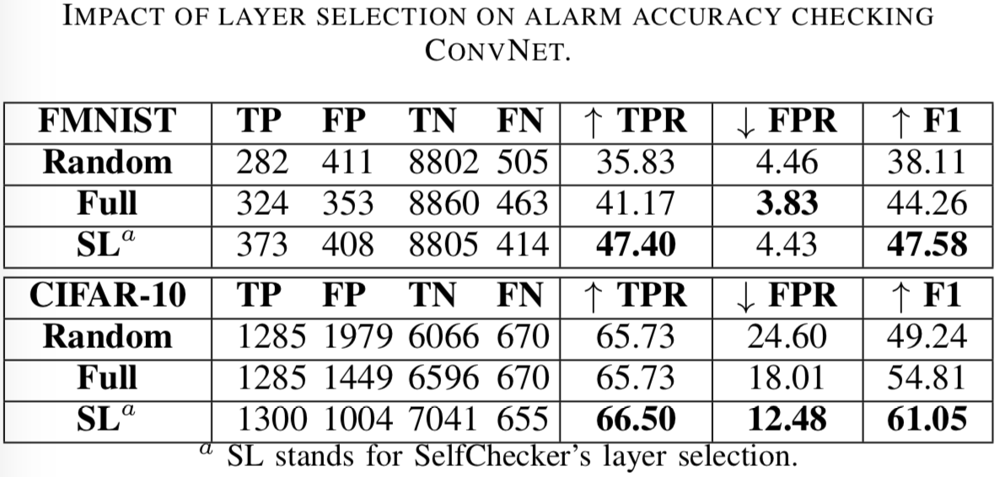

# SelfChecker
ICSE2021 Submission

Code and extra results release of the paper "Self-Checking Deep Neural Networks in Deployment".

## Introduction

In this paper we describe a self-checking system, called SelfChecker, that triggers an alarm if the internal layer features of the model are inconsistent with the final prediction. SelfChecker also provides advice in the form of an alternative prediction. This archive includes codes for generating probability density functions, performing layer selections, and alarm and advice analyses.

### Repo structure

We will update .py files later.

- `utils.py` - Util functions for log.
- `main_kde.py` - Obtain density functions for the combination of classes and layers and inferred classes.
- `kdes_generation.py` - Contain functions for generating density functions and inferred classes.
- `layer_selection_agree.py` - Layer selection for alarm.
- `layer_selection_condition.py` - Layer selection for advice.
- `layer_selection_condition_neg.py` - Layer selection for advice.
- `sc.py` - Alarm and advice analysis.
- `models/` - Folder contains pre-trained models.
- `tmp/` - Folder saving density functions and inferred classes.

### Dependencies

- `tensorflow==1.13.1`
- `Keras`
- `scipy==1.3.2`

### How to run

- We prepare a pre-trained model ConvNet on CIFAR-10: python sc.pyc
- To run the whole project: bash exe.sh

## Supplementary experimental results

### Dataset and models

### p-value

### Alarm accuracy

### Advice accuracy

### Advice accuracy on different numbers of validation samples per class

### Layer selection

### Boosting strategy

