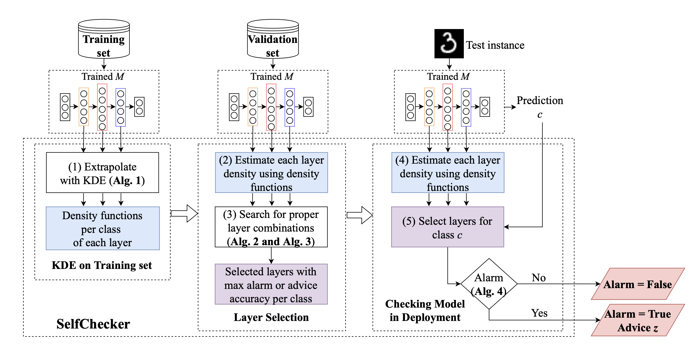
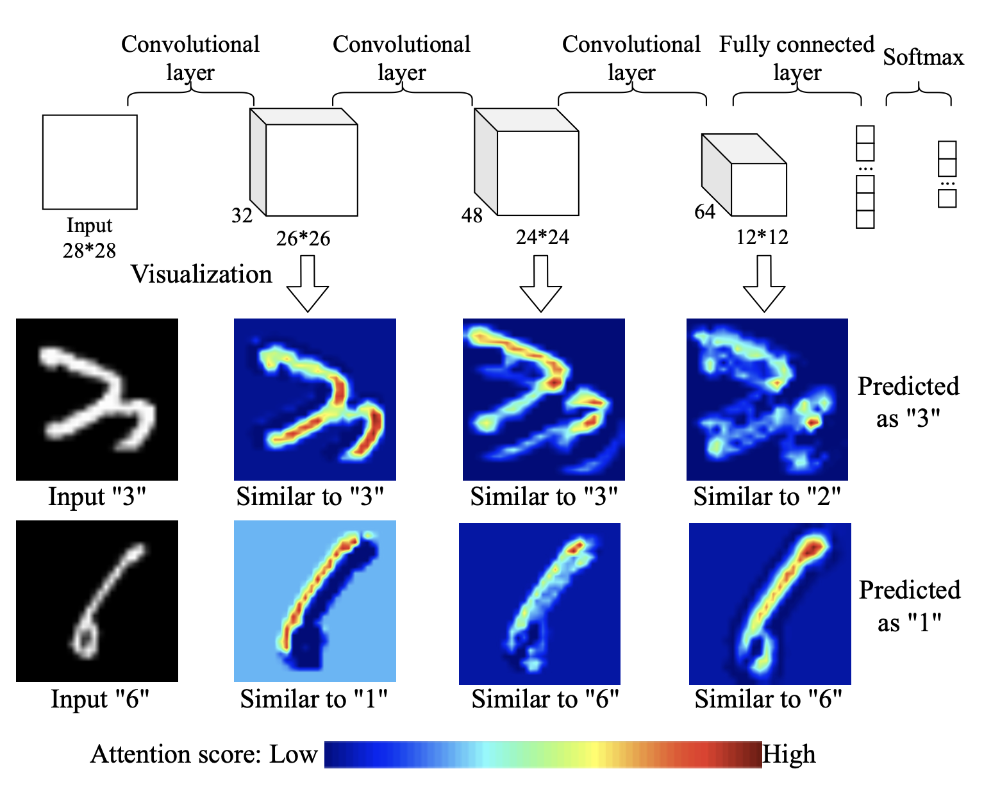

<h1 align="center">SelfChecker</h1>

<b>A self-checking tool for detecting unintended anomalies and interntiaonal adversaries in Deep Learning systems.</b>

<p align="center">
<center>
<a href=""></a>
</center>
</p>


<p align="center">
    the International Conference on Software Engineering (<b>ICSE</b>), May 2021.
    <br />
    <a href="https://yanxiao6.github.io/"><strong>Yan Xiao</strong></a> 
    <a href="https://www.cs.ubc.ca/~bestchai/"><strong>Ivan Beschastnikh</strong></a>
    <a href="https://cs.gmu.edu/~dsr/"><strong>David S. Rosenblum</strong></a>
    <a href="https://sunchangsheng.com"><strong>Changsheng Sun</strong></a>
    <a href="https://engineering.virginia.edu/faculty/sebastian-elbaum"><strong>Sebastian Elbaum</strong></a>
    <a href="http://linyun.info"><strong>Yun Lin</strong></a>
    <a href="https://www.comp.nus.edu.sg/~dongjs/"><strong>Jin Song Dong</strong></a>
    <br/><br/>
    <a href="https://www.comp.nus.edu.sg"> </a> 
    <br/><br/>
  </p>


<p align="center">
    <!-- <a href="https://pytorch.org/get-started/locally/"></a>
    <a href="https://pytorchlightning.ai/"></a><br><br> -->
    <a href='https://dl.acm.org/doi/abs/10.1109/ICSE43902.2021.00044'>
      
    </a>
    <a href='https://arxiv.org/abs/2103.02371'>
      
    </a> 
    <a href='https://trustdnn.comp.nus.edu.sg' style='padding-left: 0.5rem;'>
      
    <a href='https://youtu.be/0k7H3ZNgARE' style='padding-left: 0.5rem;'>
      
    </a>
    <a href='https://colab.research.google.com/drive/' style='padding-left: 0.5rem;'>
      
    </a>
    <a href='https://discord.gg/' style='padding-left: 0.5rem;'>
      
    </a>
  </p>
</p>

## Introduction

In this paper we describe a self-checking system, called SelfChecker, that triggers an alarm if the internal layer features of the model are inconsistent with the final prediction. 

SelfChecker also provides advice in the form of an alternative prediction. This archive includes codes for generating probability density functions, performing layer selections, and alarm and advice analyses.

<center>
<a href=""> </a>
</center>

## Repo structure

We will update .py files later.

- `utils.py` - Util functions for log.
- `main_kde.py` - Obtain density functions for the combination of classes and layers and inferred classes.
- `kdes_generation.py` - Contain functions for generating density functions and inferred classes.
- `layer_selection_agree.py` - Layer selection for alarm.
- `layer_selection_condition.py` - Layer selection for advice.
- `layer_selection_condition_neg.py` - Layer selection for advice.
- `sc.py` - Alarm and advice analysis.
- `models/` - Folder contains pre-trained models.
- `tmp/` - Folder saving density functions and inferred classes.

## Dependencies

- `tensorflow==1.13.1`
- `Keras`
- `scipy==1.3.2`

## How to run the demo

- We prepare a pre-trained model ConvNet on CIFAR-10: python sc.pyc
- To run the whole project: bash exe.sh

## APIs
### model

### training_set

### test_sample

### numclasses

### alarm

### advice

## Citation
```bibtex
@inproceedings{xiao2021self,
  title={Self-checking deep neural networks in deployment},
  author={Xiao, Yan and Beschastnikh, Ivan and Rosenblum, David S and Sun, Changsheng and Elbaum, Sebastian and Lin, Yun and Dong, Jin Song},
  booktitle={2021 IEEE/ACM 43rd International Conference on Software Engineering (ICSE)},
  pages={372--384},
  year={2021},
  organization={IEEE}
}
```

## License
This code and model are available for non-commercial scientific research purposes as defined in the [LICENSE](LICENSE) file. By downloading and using the code and model you agree to the terms in the [LICENSE](LICENSE).

## Contact

For more questions, please contact cssun@u.nus.edu
